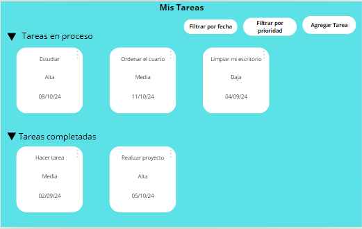
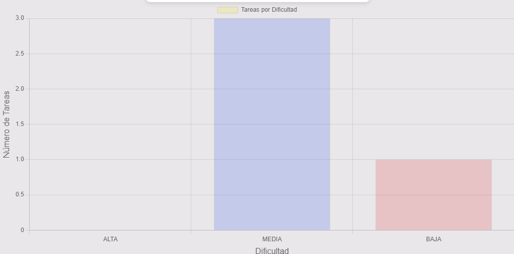
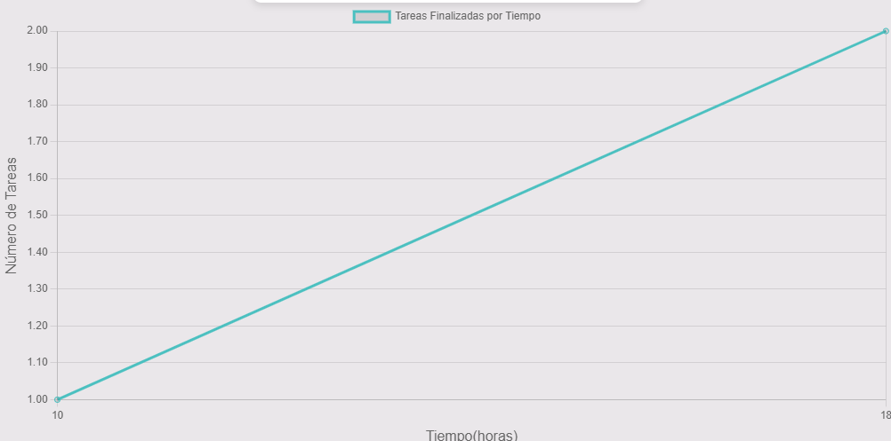
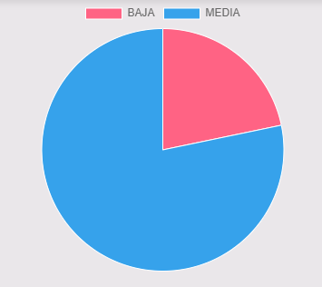
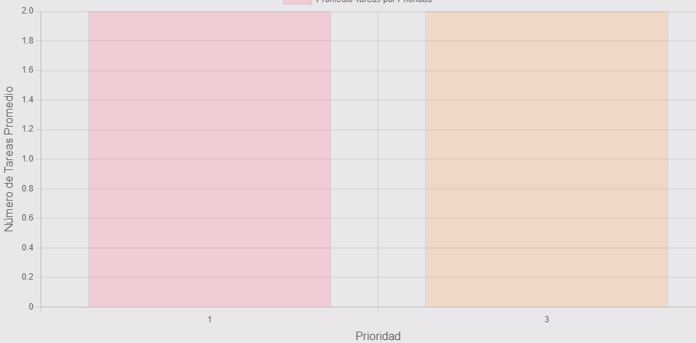

# Task Manager Project

## Descripción del Proyecto

Este proyecto es una implementación de una aplicación web para la 
gestión de tareas personales. En este repositorio se encuentra el 
desarrollo del Frontend. El objetivo principal fue afianzar 
nuestros conocimientos en el uso de React y 
desarrollar habilidades con herramientas clave del ecosistema de 
desarrollo de software, como npm para la gestión del proyecto, 
JWT para la Autenticación y Autorizacion. Además, integramos Azure 
DevOps para aplicar la metodología SCRUM, lo que nos permitió aprender 
a trabajar en equipo en entornos de desarrollo organizados y realizar 
un seguimiento eficiente de las tareas. El proyecto se estructuró en 
épicas, que se subdividieron en sprints y tareas individuales.


## Características Principales

- Agregar nuevas tareas con una descripción
- Visualizar una lista de todas las tareas existentes
- Marcar tareas como completadas
- Eliminar tareas de la lista
- Organizar tareas según la prioridad

## Tecnologías Utilizadas

- **Frontend**: HTML, CSS, JavaScript y React
- **Backend**: Java con Spring Boot
- **Base de datos**: MongoDB Cloud y sistema de almacenamiento en archivo de texto plano
- **Gestión de dependencias**: Maven y npm
- **Control de versiones**: Git y GitHub
- **Análisis de código**: SonarQube
- **Cobertura de pruebas**: JaCoCo
- **Autenticaión y Autorización**: JWT

## Requisitos del Sistema

- Node.js: 17.x.x
- npm: 10.x.x

## Configuración del Proyecto

1. Clonar el repositorio:
   ```
   git clone https://github.com/thesrcielos/BarquitaFrontend
   ```

2. Navegar al directorio del proyecto:
   ```
   cd BarquitaFrontend
   ```

3. Instalar las dependencias del proyecto:
   ```
   npm install
   ```

4. Ejecutar la aplicación:
   ```
   npm start
   ```
## Mockup de la aplicación



## Librerías para la generación de gráficos
### 1.D3.js
Pros:
    Alta flexibilidad y control: Permite manipular directamente el DOM y crear gráficos personalizados.
    Gran potencia: Ideal para visualizaciones complejas e interactivas (ej. gráficas de red o mapas).
    Extensibilidad: Puedes crear casi cualquier tipo de gráfico desde cero.
    Amplio ecosistema: Hay muchas herramientas y plugins basados en D3.js.

Contras:
    Curva de aprendizaje pronunciada: La sintaxis es compleja, especialmente para principiantes.
    Requiere más código: Hay que definir muchos detalles manualmente.
    Mantenimiento costoso: Las actualizaciones pueden ser complicadas debido a los cambios en las versiones.
    
### 2.C3.js
(C3.js es un wrapper de D3.js que simplifica su uso.)
Pros:
    Facilidad de uso: Simplifica la implementación de gráficos sin perder el poder de D3.js.
    Configuraciones declarativas: Permite definir gráficos con menos código que D3.js.
    Gráficos responsivos: Soporte nativo para gráficos adaptables.

Contras:
    Menos flexibilidad que D3.js: Si necesitas gráficos muy personalizados, C3 puede ser limitado.
    Menor popularidad y soporte: Comparado con otras opciones, tiene una comunidad más pequeña.
    Desarrollo menos activo: Las actualizaciones son más lentas que en otras librerías.
### 3.Chart.js
Pros:
    Fácil de aprender e implementar: Ideal para proyectos pequeños o cuando no se necesita mucha personalización.
    Soporte para múltiples tipos de gráficos: Barras, líneas, pasteles, etc.
    Buen soporte de comunidad: Amplia documentación y ejemplos.
    Gráficos interactivos y animaciones: Incorporadas sin necesidad de código extra.

Contras:
    Limitada personalización: No es tan flexible como D3.js para gráficos más complejos.
    Pesada en proyectos grandes: Puede volverse lenta si se manejan grandes volúmenes de datos.
    Problemas con gráficos muy complejos: Difícil de escalar para necesidades muy específicas.
### 4. Google Charts
Pros:
    Fácil de usar: Configuración sencilla basada en JavaScript.
    Integración con otros productos de Google: Como Google Sheets y Google Analytics.
    Gráficos interactivos y responsivos: Soporte para adaptabilidad sin esfuerzo adicional.
    Hosting gratuito: No necesitas incluir archivos locales; todo se carga desde Google.

Contras:
    Dependencia de Google: Necesitas acceso a Internet para cargar las librerías.
    Opciones limitadas de personalización: Si buscas algo más elaborado, puede no ser suficiente.
    Riesgo de cambios inesperados: Al ser controlado por Google, pueden ocurrir cambios o deprecaciones sin previo aviso.
    
### Libreria Escogida:
La librería que decidimos escoger fue la de Chart.js debido a que es una de las más sencillas de aprender y es bastante simple su implementación. Además, en un proyecto pequeño como este el uso de esta librería es mas que suficiente.

#### Gráficas
#### Número de Tareas por Prioridad



#### Número de Tareas Terminadas por Tiempo



#### Tiempo Total por Tareas Realizadas



#### Número de Tareas por Dificutad


### Contribución

Si deseas contribuir a nuestro proyecto, 
te invitamos a hacer un fork del repositorio y enviar una Pull Request 
(PR). Agradecemos cualquier comentario o retroalimentación que 
nos ayude a mejorar y continuar creciendo.

## Colaboradores
* [Diego Macia]()
* [Daniel Aldana]()
* [Santiago Avellaneda]()
* [Miguel Motta]()